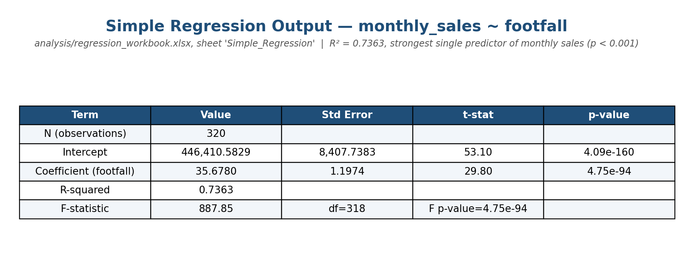
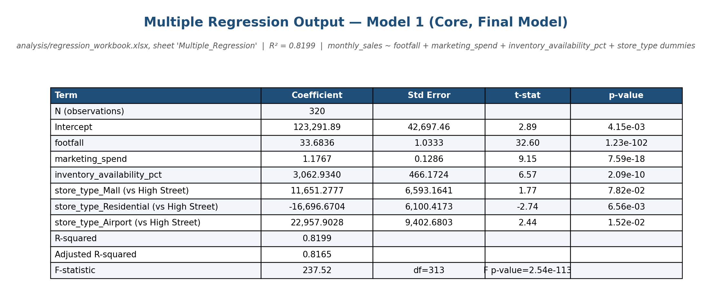
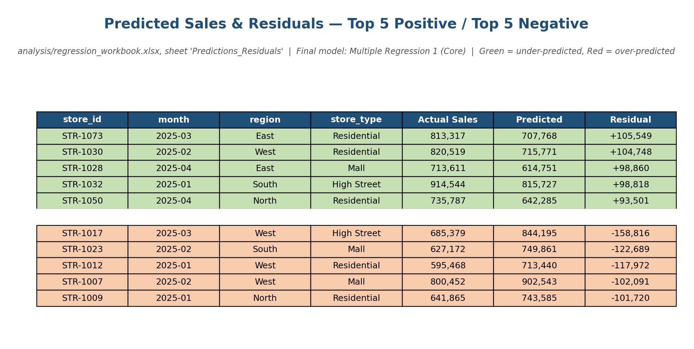
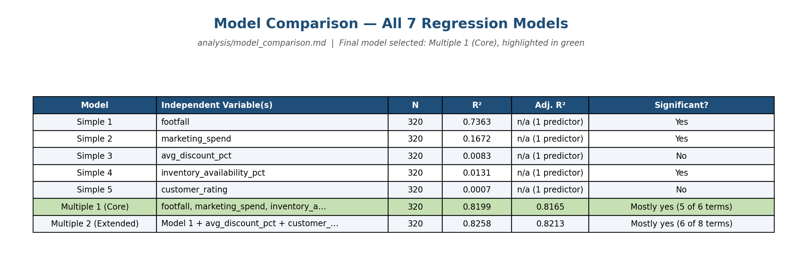

# Regression Insights — What Drives Monthly Store Sales?

## 1. Business Problem Summary

Leadership at this retail chain wants to know what's actually driving monthly sales performance
across stores, before committing to actions like raising marketing budgets, tightening inventory
management, changing discounting policy, reallocating staff, or favoring certain store types or
regions. This project uses regression analysis on 80 stores over 4 months to identify which
factors are most strongly associated with `monthly_sales`, and turns that into a concrete business
recommendation.

## 2. Dataset Description

**Source:** `data/business_regression_data.xlsx`, sheet `store_performance` — **320 rows**
(80 stores × 4 months, Jan–Apr 2025), plus a `data_dictionary` sheet.

| Column | Description |
|---|---|
| `store_id` | Unique store identifier |
| `month` | Reporting month |
| `region` | Business region (East, North, South, West) |
| `store_type` | Mall, High Street, Residential, or Airport |
| `marketing_spend` | Monthly marketing spend for the store |
| `footfall` | Monthly visitor count |
| `avg_discount_pct` | Average discount percentage for the month |
| `staff_count` | Number of store staff |
| `inventory_availability_pct` | Average product availability percentage |
| `competitor_distance_km` | Distance to nearest competitor |
| `holiday_flag` | 1 if the period had a meaningful holiday effect, else 0 |
| `customer_rating` | Average customer rating |
| `monthly_sales` | **Dependent variable** |
| `monthly_profit` | Optional secondary business metric (not used as a predictor — see below) |

Two fields had missing values, imputed with the column mean and flagged for audit:
`customer_rating` (8 of 320 rows) and `competitor_distance_km` (6 of 320 rows). No rows were
removed — all 320 are used in every model.

### Task 1 — variable review

- **Dependent variable:** `monthly_sales`.
- **Potential independent variables:** `marketing_spend`, `footfall`, `avg_discount_pct`,
  `staff_count`, `inventory_availability_pct`, `competitor_distance_km`, `holiday_flag`,
  `customer_rating`, `region`, `store_type`.
- **Numerical variables:** `marketing_spend`, `footfall`, `avg_discount_pct`, `staff_count`,
  `inventory_availability_pct`, `competitor_distance_km`, `customer_rating`, `holiday_flag`
  (0/1 indicator, numeric but binary).
- **Categorical variables:** `region`, `store_type` (converted to dummy variables — see below).
- **Variables needing cleaning/transformation:** `customer_rating` and `competitor_distance_km`
  (missing values imputed); `region`/`store_type` (converted to dummies).
- **Variables not useful for regression:** `store_id` (a unique identifier, no predictive
  meaning); `month` (only 4 distinct values present, too little variation to model seasonality
  beyond `holiday_flag`); **`monthly_profit`** (excluded as a *predictor* — it's a downstream
  outcome of sales, not a driver of it, so using it to predict `monthly_sales` would be circular).
  **`staff_count`** was also excluded from every multiple regression — not because it's
  meaningless, but because it correlates 0.92 with `footfall` (confirmed with a variance
  inflation factor of ~6.4 when both are included), so the two can't be cleanly separated
  statistically in this dataset.

## 3. Dependent and Independent Variables

- **Dependent:** `monthly_sales`
- **Independent (final model):** `footfall`, `marketing_spend`, `inventory_availability_pct`,
  plus `store_type` dummies (`store_type_Mall`, `store_type_Residential`, `store_type_Airport`;
  reference = High Street)

## 4. Regression Approach

1. **5 simple regressions** — `monthly_sales` against one predictor at a time
   (`footfall`, `marketing_spend`, `avg_discount_pct`, `inventory_availability_pct`,
   `customer_rating`).
2. **2 multiple regressions** — a Core model (footfall + marketing_spend +
   inventory_availability_pct + store_type dummies) and an Extended model (Core + avg_discount_pct
   + customer_rating), to test whether the extra variables earn their place.
3. All regressions are computed with Excel's `LINEST()` array formula in
   `analysis/regression_workbook.xlsx`, cross-validated line-by-line against an independent
   Python/statsmodels calculation — every coefficient, standard error, R², and p-value matches.

## 5. Dummy Variable Approach

`store_type` has 4 categories. Using all 4 as dummies would create perfect redundancy (the "dummy
variable trap" — the 4 columns would always sum to 1, making them collinear with the intercept).
So only **3** dummies are created — `store_type_Mall`, `store_type_Residential`,
`store_type_Airport` — with **High Street as the reference category** (the most frequent group,
116 of 320 rows). Each dummy coefficient is read as "the difference from a High Street store with
the same footfall/marketing/inventory profile." The same approach was applied to `region` (ref =
East) for completeness in `analysis/regression_workbook.xlsx`, sheet `Dummy_Variables`, though the
final model uses `store_type` dummies only. Full detail in `outputs/model_equations.md`.

## 6. Model Comparison Summary

| Model | R² | Significant? |
|---|---|---|
| Simple: footfall | 0.7363 | Yes |
| Simple: marketing_spend | 0.1672 | Yes |
| Simple: avg_discount_pct | 0.0083 | No |
| Simple: inventory_availability_pct | 0.0131 | Borderline |
| Simple: customer_rating | 0.0007 | No |
| **Multiple 1 (Core)** | **0.8199** | Mostly (5 of 6 terms) |
| Multiple 2 (Extended) | 0.8258 | Mostly (6 of 8 terms) |

Full comparison with limitations per model: `analysis/model_comparison.md`.

## 7. Final Model Selected

**Multiple Regression 1 (Core):**

```
monthly_sales = 123,291.89 + 33.68×footfall + 1.18×marketing_spend + 3,062.93×inventory_availability_pct
                + 11,651.28×store_type_Mall − 16,696.67×store_type_Residential + 22,957.90×store_type_Airport
```

R² = 0.8199, Adj. R² = 0.8165, N = 320. Selected over the Extended model because it explains
almost as much variation with 2 fewer variables, every numerical predictor is highly significant,
and it doesn't rely on `avg_discount_pct`, which is not significant in either specification. Full
reasoning: `outputs/model_equations.md`.

## 8. Business Recommendation

Footfall, inventory availability, and marketing spend — in that order of strength — are the most
reliable, actionable drivers of monthly sales in this data. **Inventory availability is the
standout near-term lever**: weak on its own, but one of the clearest effects once other factors
are controlled for, and more operationally fixable than footfall. Residential stores underperform
equivalent High Street stores by ~₹16,700/month even after controlling for footfall, marketing,
and inventory — worth a dedicated review. Discounting (`avg_discount_pct`) is **not** supported as
a sales driver by this data and shouldn't be over-weighted in planning. Full answer to all 6
required recommendation questions, including the association-vs-causation discussion:
`outputs/final_recommendation.md`.

## 9. Assumptions and Limitations

- Only 4 months of data — not enough to separate seasonality from the `holiday_flag` indicator.
- `staff_count` excluded from every multiple regression due to severe multicollinearity with
  `footfall` (corr. 0.92, VIF ~6.4 if both included).
- `region` was not included in the final model; the residual analysis shows a modest, genuine
  regional pattern the model doesn't capture (East over-predicted by ~₹10,800 on average, South
  under-predicted by ~₹9,300) — see `analysis/residual_analysis.md`.
- Missing `customer_rating` (8 rows) and `competitor_distance_km` (6 rows) were imputed with the
  column mean — a reasonable simplification for a regression exercise, but it slightly understates
  the true uncertainty for those specific rows.
- **Regression shows association, not causation** — no variable here was randomly assigned, so
  reverse causation (successful stores attract more marketing budget) and omitted variables (e.g.
  store management quality) remain plausible alternative explanations. See
  `outputs/final_recommendation.md`, question 6, for the full discussion.
- `outputs/regression_summary.xlsx` and `analysis/regression_workbook.xlsx` each embed their own
  self-contained copy of the data rather than linking live to one another, to avoid fragile
  cross-file references — both were independently verified to produce identical results.

## 10. Screenshots Included

**Simple regression output** (`footfall` — the strongest single predictor):



**Multiple regression output** (Model 1 — Core, the final selected model):



**Predicted sales and residuals** (top 5 largest positive and negative misses):



**Model comparison across all 7 models:**



---

